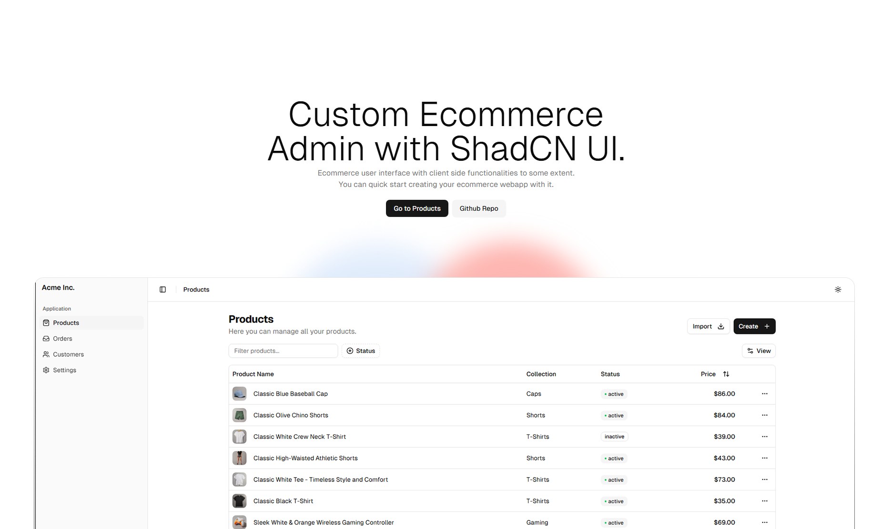

# CustomEcom Admin Dashboard

Hey! 👋 This is **CustomEcom Admin Dashboard**, a Next.js-based ecommerce admin panel built with [shadcn/ui](https://ui.shadcn.com/) and Tailwind CSS. I made this for devs who want a clean, modern, and actually customizable dashboard for their store, without all the corporate bloat.



## What is this?
A simple, open-source ecommerce admin dashboard. You get:
- **Products**: List, create, and view product details
- **Orders**: See and manage orders
- **Customers**: View your customer list
- **Settings**: Store/account/notification/display settings

All pages are ready to be tweaked, extended, or ripped apart for your own needs. No backend, just UI and client-side logic. You can wire it up to your own API or database.

## Why?
Most dashboards out there are either too opinionated, too ugly, or too hard to customize. I wanted something that:
- Looks good out of the box (thanks shadcn/ui)
- Is easy to hack on
- Doesn't force you into a specific stack
- Lets you build your own thing, fast

## Tech Stack
- [Next.js](https://nextjs.org/) (App Router)
- [shadcn/ui](https://ui.shadcn.com/) (for all the UI components)
- [Tailwind CSS](https://tailwindcss.com/)
- [React Hook Form](https://react-hook-form.com/)
- [Zod](https://zod.dev/)
- [Lucide Icons](https://lucide.dev/) for icons

**Video Preview**
<video src="./public/preview.mp4" alt="Video preview showing customecom admin dashboard">

## Getting Started
1. Clone this repo
2. Install dependencies:
   ```bash
   bun install # or npm install or yarn install
   ```
3. Run the dev server:
   ```bash
   bun run dev # or npm run dev or yarn dev
   ```
4. Open [http://localhost:3000](http://localhost:3000)

## Customization
- All UI is built with shadcn/ui, so you can swap out components, change styles, or add new pages easily.
- The sidebar, header, and table layouts are modular.
- No backend included, so you can plug in your own API, database, or whatever.

## Pages
- `/products` — Product list
- `/products/create` — Create new product
- `/products/details` — Product details (should be replaced with [id])
- `/orders` — Orders list
- `/customers` — Customer list
- `/settings` — Store/account/notification/display settings

## Screenshots
_You take some screenshots and make a PR then hahaha_

## License
MIT. Do whatever you want. If you make something cool, let me know!

---

Leave a star if it helps 😁
